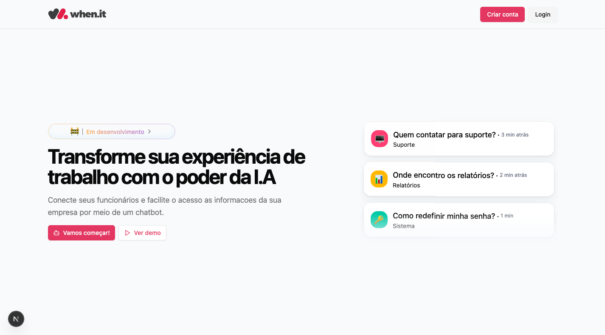

# when.it


## 📖 Description
When.it is an AI-powered platform designed to connect team members with their organization's knowledge base. By leveraging the RAG (Retrieval-Augmented Generation) strategy, it enables employees to quickly resolve their questions through an intelligent chatbot experience.



## 🛠️ Technologies Used

### Frontend
- [Next.js](https://nextjs.org/) – React framework for building fast and scalable web applications  
- [Tailwind CSS](https://tailwindcss.com/) – Utility-first CSS framework for rapid UI development  

### Backend
- [NestJS](https://nestjs.com/) – Progressive Node.js framework for building efficient and scalable server-side applications  
- [OpenAI API](https://platform.openai.com/docs) – Integration for AI-powered responses  
- [Pinecone](https://www.pinecone.io/) – Vector database for semantic search and retrieval  
- [Cloudinary](https://cloudinary.com/) – Media management and optimization platform for storing and delivering images, videos, and documents

### Database
- [PostgreSQL](https://www.postgresql.org/) – Robust and open-source relational database system

## ⚙️ Installation

### 📋 Prerequisites

- [Node.js](https://nodejs.org/) (v18 or higher)
- [PostgreSQL](https://www.postgresql.org/)
- [Pinecone API Key](https://www.pinecone.io/start/)
- [OpenAI API Key](https://platform.openai.com/account/api-keys)

---

### 📦 Clone the repository

```bash
git clone https://github.com/your-username/when.it.git
cd when.it
```

### 🖥️ Backend ```(/api)```

#### Setup
```bash
cd api
cp .env.example .env
npm install
```

### Run the development server
```bash

npm run start:dev
```

### 🌐 Frontend ```(/web)```

#### Setup
```bash
cd web
cp .env.example .env
npm install
```

## ✅ You're good to go!
- **Frontend**: http://localhost:3000
- **Backend**: http://localhost:3333